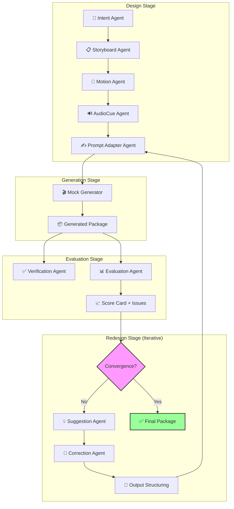

# ShotForge / 镜铸

<div align="center">

**🎬 AI Video Creative Agent Harness — Don't just generate, iterate until it's right.**

*"一次生成是抽卡，迭代收敛才是工程。"*

[](https://www.python.org/)
[](LICENSE)
[](https://www.langgraph.dev/)
[](https://docs.pydantic.dev/)
[]()

</div>

---

## 🤔 为什么需要 ShotForge？

### 行业痛点

当前文生视频领域，所有人都在卷"一次生成的质量"：

| 工具 | 模式 | 问题 |
|------|------|------|
| Runway Gen-3 | Prompt → 单次生成 | 结果不可控，不满意只能重来 |
| Sora / Kling | Prompt → 单次生成 | 同样的 Prompt，质量方差巨大 |
| ComfyUI | 节点编排 → 生成 | 管线能力强，但无评估反馈 |
| 开源模型 | Prompt → 生成 | 单次效果差，调参成本高 |

**核心矛盾：** 复杂组合性视频（多对象、属性绑定、动态交互、空间关系）无法通过单次生成可靠产出。这是 **系统复杂性问题**，不是模型能力问题。

### 我们的洞察

受 [GenMAC (CVPR 2025)](https://arxiv.org/abs/2412.04440) 论文启发，我们认为：

> **"复杂任务可以分解为简单子任务，由角色专业化的 Agent 协作完成。视频生成不是一键出片，而是 Design → Generate → Evaluate → Redesign 的收敛迭代过程。"**

```
不是:  Prompt ──────────────────→ 🎥 视频 (碰运气)
而是:  Prompt → 🧠 设计 → 🎥 生成 → 🔍 评估 → 🔧 修正 → 🎥 再生成 → ... → ✅ 收敛
```

### 💰 成本优化：小模型迭代收敛 + 大模型精准花钱

这是 ShotForge 的另一层核心设计哲学：

```
┌──────────────────────────────────────────────────────────────┐
│                   ShotForge 成本优化策略                       │
├──────────────────────────────────────────────────────────────┤
│                                                              │
│  阶段1: 迭代收敛（便宜）                                       │
│  ┌─────────────────────────────────────────────────────┐    │
│  │ 本地小模型 / Mock / 低分辨率                          │    │
│  │ ↓                                                    │    │
│  │ Design → Generate(cheap) → Evaluate → Redesign       │    │
│  │ ↓                                                    │    │
│  │ 反复迭代，收敛到高质量 "方案模板包"                      │    │
│  │ (Storyboard + Motion + AudioCue + Prompt 全部打磨好)    │    │
│  └─────────────────────────────────────────────────────┘    │
│                          ↓                                   │
│  阶段2: 精细生成（只在最终版花钱）                              │
│  ┌─────────────────────────────────────────────────────┐    │
│  │ 收敛后的方案包 → 大模型/高分辨率 API (Kling/Runway)     │    │
│  │ ↓                                                    │    │
│  │ 一次性高质量输出，不反复试错                             │    │
│  └─────────────────────────────────────────────────────┘    │
│                                                              │
│  成本对比:                                                     │
│  ┌──────────────┬──────────────────┬──────────────────┐    │
│  │   方案        │  大模型调用次数   │   估算成本/视频    │    │
│  ├──────────────┼──────────────────┼──────────────────┤    │
│  │ 传统反复试错   │  5-20 次         │  $2.5-10.0       │    │
│  │ ShotForge    │  1 次            │  $0.5-1.0        │    │
│  └──────────────┴──────────────────┴──────────────────┘    │
└──────────────────────────────────────────────────────────────┘
```

**核心思想：** 在小模型/本地模型上把方案打磨到收敛，得到一个精雕细琢的 Storyboard + Motion Spec + Prompt 组合包，只在最后一步调用昂贵的大模型 API 进行高清生成。迭代成本趋近于零，精细生成只花一次钱。

> 更多技术细节参见 [GenMAC 论文](https://arxiv.org/abs/2412.04440) 和我们的 [技术博客（即将发布）]()。

---

## 🏗️ 系统架构



### 分层架构

```
┌─────────────────────────────────────────────────┐
│  CLI / Web UI / API          ← 用户入口          │
├─────────────────────────────────────────────────┤
│  LangGraph StateGraph        ← Agent 流程编排     │
│  (State + Node + Edge + Checkpoint + Interrupt)  │
├─────────────────────────────────────────────────┤
│  LLM Provider / Generator Provider  ← 模型接入   │
│  EvaluatorRegistry / SkillRegistry ← 可插拔协议   │
├─────────────────────────────────────────────────┤
│  KnowledgeBase / Rubric / TraceLog   ← 知识 & 评测 │
│  VersionManager / ConvergenceEngine ← 版本 & 收敛 │
└─────────────────────────────────────────────────┘
```
```

---

## ⚡ 快速开始

### 安装

```powershell
cd C:\Users\whaid\OneDrive\Project\ShotForge
python -m venv .venv
.\.venv\Scripts\Activate.ps1
pip install -e ".[dev]"
```

### CLI 使用

```powershell
# 纯设计模式 (生成方案包)
shotforge design "一只赛博猫在雨夜上海屋顶追逐发光无人机"

# 完整流程 (设计 + 评估 + 迭代修正)
shotforge full-loop "一只赛博猫在雨夜上海屋顶追逐发光无人机"

# 英文场景
shotforge full-loop "A neon train crossing a desert at sunrise" --language en

# 评估已有方案包
shotforge evaluate data/runs/20260522_0918/package.json

# 查看运行 Trace
shotforge inspect data/runs/20260522_0918/package.json
```

### Web Demo

```powershell
uvicorn shotforge.app.web.app:app --reload
```

打开 `http://127.0.0.1:8000`，输入创意即可体验完整流程。

### API

```http
POST /api/runs
Content-Type: application/json

{
  "idea": "A cinematic AI video idea",
  "style": "cinematic",
  "language": "zh",
  "duration_seconds": 24,
  "with_evaluation": true,
  "rubric_id": "baseline_v1"
}
```

下载产物：
```http
GET /api/runs/{run_id}/export/json          # 完整方案包
GET /api/runs/{run_id}/export/csv           # 分镜 CSV
GET /api/runs/{run_id}/export/markdown      # 方案文档
GET /api/runs/{run_id}/export/evaluation_csv # 评估报告
```

---

## 📊 评估体系

ShotForge 内置 **9 维评估维度**，所有维度权重、阈值、修正策略均可通过 JSON 配置：

| 维度 | 权重 | 评估内容 |
|------|------|---------|
| `character_consistency` | 1.0 | 角色视觉/行为连贯性 |
| `scene_consistency` | 1.0 | 场景空间与身份一致性 |
| `action_clarity` | 1.2 | 主体动作可读性 |
| `emotional_intensity` | 1.1 | 情感表达的准确性 |
| `camera_expression` | 1.0 | 镜头语言对叙事的支撑 |
| `pacing_progression` | 1.0 | 节奏递进与张弛 |
| `reversal_expression` | 0.8 | 揭示/反转的可感知性 |
| `audio_timing` | 0.9 | 音频提示与视觉节拍的同步 |
| `prompt_executability` | 1.1 | 提示词的可执行性 |

```json
// 自定义评估维度: shotforge/knowledge/evaluation_rubrics.json
{
  "baseline_v1": {
    "dimensions": [
      {
        "id": "character_consistency",
        "weight": 1.0,
        "max_score": 1.0,
        "issue_rule": {
          "threshold": 0.5,
          "correction_type": "consistency"
        }
      }
    ]
  }
}
```

---

## 🔌 可插拔架构

### Evaluator 插件

```python
# 实现自定义评估器
class RealismEvaluator:
    def evaluate(self, context: EvaluatorContext) -> list[EvaluationSignal]:
        # 接入 VLM 模型评估真实感
        ...
```

### Generator 插件

```python
# 对接真实视频生成 API
class KlingGenerator:
    async def generate(self, prompt: PromptPackage) -> GeneratedResult:
        # 调用 Kling API
        ...
```

### Correction Agent 插件

```python
# 新增修正类型
class LightingCorrectionAgent(CorrectionAgent):
    correction_type = "lighting"
    ...
```

---

## 🗺️ 发展路线图

| 阶段 | 里程碑 | 状态 |
|------|--------|------|
| **V0** | 纯设计 Pipeline (Intent→Storyboard→Motion→Audio→Prompt) + 多格式导出 | ✅ 完成 |
| **V1** | Mock 生成 + 9维评估体系 + EvaluatorProvider 协议 | ✅ 完成 |
| **V2** | GeneratorProvider 协议 + Redesign & Convergence Loop（评估→修正→再生成→收敛） | ✅ 核心闭环完成 |
| **V2.5** | 轻量 Generator 接入 + MP4 导出（本地生成 + 画幅/压缩可配） | 📋 规划中 |
| **V3** | Generator Provider 体系 + 多模型路由 + 成本优化策略 | 📋 规划中 |
| **V4** | MCP 协议 + Sandbox + Memory（Agent Infra 完整化） | 📋 规划中 |
| **V5** | 社区版 Release + 插件市场 + 收敛配方分享 | 📋 规划中 |

### 版本详情

<details>
<summary><b>V0 · Design Harness · ✅ 完成</b></summary>

**核心价值：** 从一句话创意到结构化视频方案包。

```
Idea → Intent Agent → Storyboard Agent → Motion Agent
     → AudioCue Agent → Prompt Adapter Agent → Export Agent
     → JSON / CSV / Markdown / 分镜表导出
```

**产出物：** `ProjectState` / `CreativeIntent` / `SceneSpec` / `ShotSpec` / `MotionSpec` / `AudioCue` / `PromptPackage`

</details>

<details>
<summary><b>V1 · Evaluation Baseline · ✅ 完成</b></summary>

**核心价值：** 把"不好"变成可量化的结构化问题。

```
Design Package → Mock Generator → Verification Agent
               → Evaluation Agent → 9-Dimension Score Card + IssueList
               → EvaluatorProvider + SignalAggregator 可插拔协议
```

**9 维评估：** `character_consistency` / `scene_consistency` / `action_clarity` / `emotional_intensity` / `camera_expression` / `pacing_progression` / `reversal_expression` / `audio_timing` / `prompt_executability`

</details>

<details>
<summary><b>V2 · GeneratorProvider + Redesign & Convergence Loop · ✅ 核心闭环完成</b></summary>

**核心价值：** 让 GenMAC 思路工程化落地——自动识别问题、定向修正、验证收敛。

```
GeneratedResult → Verification Agent → Suggestion Agent
                → Correction Router
                    ├─ ActionCorrectionAgent
                    ├─ EmotionCorrectionAgent
                    ├─ CharacterCorrectionAgent
                    ├─ SceneCorrectionAgent
                    ├─ CameraCorrectionAgent
                    ├─ AudioCorrectionAgent
                    └─ PromptCorrectionAgent
                → Output Structuring Agent
                → GeneratorProvider.generate()  ← 真实/Mock 可切换
                → 重新评估 → ConvergenceEngine
                → Version Snapshot + VersionDiff + RegressionCheck
```

**与 GenMAC 论文对应：**
| GenMAC | ShotForge V2 |
|--------|-------------|
| Design Stage | `design_workflow.py` |
| Generation Stage | `generators/base.py` (GeneratorProvider 协议) |
| Verification Agent | `verification_agent.py` |
| Suggestion Agent | `suggestion_agent.py` |
| Correction Agent | `correction/*.py` + `correction_router.py` |
| Output Structuring Agent | `output_structuring_agent.py` |
| Iterative Refinement | `convergence_engine.py` |

**GeneratorProvider 协议（V2 必须提供）：**
```python
class GeneratorProvider(Protocol):
    """生成器抽象——Mock 和真实生成器实现同一接口"""
    provider_id: str
    display_name: str
    def generate(self, state: ProjectState) -> GeneratedResult: ...
    def supports_real_generation(self) -> bool: ...
    def estimate_cost(self, state: ProjectState) -> GenerationCostEstimate: ...
    def capabilities(self) -> GeneratorCapabilities: ...

# V2 默认实现
class MockGenerator(GeneratorProvider): ...  # 开发测试用
# V2 Provider Catalog
# mock 可运行；ComfyUI / Open-Sora / Kling / Jimeng / Runway 已作为 planned provider 进入目录
```

**已完成的 V2 工程能力：**
- Web/API/CLI 支持 `generator_provider_id`，Web 使用 Provider 下拉。
- 支持用户配置最大迭代轮数（2-10，默认 3），该值是上限；如果生产包已无有效变化，会提前停止。
- 每轮迭代持久化版本快照，支持 `v1 → v2 → v3...` 追踪。
- `CorrectionRouter` 负责 plan → agent 路由，未注册 agent 会记录 skip reason。
- `ConvergenceEngine` 记录 `ConvergenceStep`、`ScoreDelta`、`RegressionCheck`，停止条件通过策略对象扩展。
- Web 提供版本链路视图，每轮 diff 可展开查看 before/after 字段变化。
- `knowledge/correction_strategies.json` 承载修正策略文案，CorrectionAgent 只负责生成结构化 patch。
- `/api/runs/{run_id}/versions` 可查看当前项目的版本快照列表。

**收敛停止条件（当前简版，可继续扩展）：** 最大迭代轮数 / 评分提升低于阈值 / 检测到回归 / 已解决跟踪问题

</details>

<details>
<summary><b>V2.5 · Lightweight Generator + MP4 Export · 📋 规划中</b></summary>

**核心价值：** 方案包 → 真实可见的 MP4 成品，完成"最后一公里"闭环。同时验证 Redesign Loop 在真实模型上的有效性。

```
收敛的方案包 → ComfyUI 本地生成（最便宜、最可控）
             → Open-Sora / 开源图生视频（离线可用）
             → FFmpeg 片段拼接 → MP4 导出
             → 支持画幅配置（16:9 / 9:16 / 1:1）
             → 支持压缩比/分辨率配置
```

**为什么先接本地而非商业 API：**
- 迭代收敛阶段需要频繁调用生成器 → 本地免费
- 收敛后方案包已是最优 → 再对接商业 API 只花一次钱（V3）
- 验证修正逻辑在真实生成上是否有效

**MP4 导出策略：** 只做基础拼接 + 画幅/压缩配置。不做在线剪辑器、不做字幕编辑器、不做 BGM 库——超出边界需求通过工程文件导出（DaVinci XML）对接专业工具。

</details>

<details>
<summary><b>V3 · Generator Provider System · 📋 规划中</b></summary>

**核心价值：** 模型无关的生成器插件体系 + 成本优化策略落地。

```
GeneratorProvider 协议
├── Mock Generator（开发测试用）
├── ComfyUI Provider（本地免费，迭代收敛主力）
├── Open-Sora Provider（开源图生视频）
├── Kling Provider（商业模型，仅收敛后一次性调用）
├── Runway Provider（商业模型，仅收敛后一次性调用）
└── Jimeng Provider（商业模型，仅收敛后一次性调用）

多模型路由策略：
├── 迭代阶段：本地小模型，零成本
├── Benchmark 阶段：商业模型对照，小样本
└── 交付阶段：商业模型 + 收敛方案包，一次性高质量输出
```

**成本策略落地：** "小模型打磨方案 + 大模型精准花钱" ——迭代在小模型上跑 50 轮不心疼，最终调用商业 API 只 1 次。

</details>

<details>
<summary><b>V4 · Agent Infra 完整化 · 📋 规划中</b></summary>

**核心价值：** 让 ShotForge 成为 Agent Harness 工程实践的标杆案例。

```
├── MCP 协议：ShotForge Skill 暴露为 MCP Tool
│             KnowledgeBase 暴露为 MCP Resource
│             支持 stdio + HTTP SSE Transport
├── Agent Sandbox：Docker 隔离 Skill 执行
│                  危险命令拦截 + 资源限制
├── Agent Memory：LangGraph Checkpoint 跨 Session 持久化
│                 用户偏好向量记忆 + 历史 Run 总结
├── RAG 升级：ChromaDB 向量存储
│             Hybrid Search + BGE-Reranker
├── Human-in-the-Loop：Evaluatiuon 节点审批中断
└── 可观测性：LangFuse Tracing + Token/Cost/Latency 面板
```

</details>

<details>
<summary><b>V5 · 社区 & 生态 · 📋 规划中</b></summary>

**核心价值：** 从一个人的项目变成社区的产品。

```
├── 插件市场：社区贡献 Evaluator / CorrectionAgent / Generator
├── 收敛配方分享：行业场景的最佳迭代策略
├── ShotForge Cloud：托管版 Web 服务（商业化起步）
└── 中英双语文档 + 技术博客 + Demo 视频
```

**商业化三层阶梯：**
```
Layer 1: 开源社区版 → MIT 协议，免费获客
Layer 2: ShotForge Cloud → $19-99/月订阅，省心托管
Layer 3: 企业版 → 年费制，私有化部署 + 定制评估维度 + 行业收敛配方
```

</details>

---

## 🏛️ 项目结构

```
shotforge/
├── app/                    # 应用入口
│   ├── api/                # REST API (预留)
│   ├── cli/                # Typer CLI
│   └── web/                # FastAPI Web Demo
├── core/                   # 核心领域模型与工程
│   ├── project_state.py    # 300+ 字段 Pydantic 状态模型
│   ├── context_builder.py  # Agent 上下文构建器
│   ├── knowledge_base.py   # 知识库 (标签检索)
│   ├── rubrics.py          # 评估量表注册
│   ├── trace_log.py        # 执行追踪日志
│   ├── version_manager.py  # 版本管理 (Snapshot/Fork/Diff)
│   ├── convergence_engine.py # 迭代收敛引擎
│   ├── regression_check.py # 回归检测
│   └── schemas/            # 子 Schema
├── agents/                 # 多 Agent 体系
│   ├── design/             # 设计 Agent (5 个)
│   │   ├── intent_agent.py
│   │   ├── storyboard_agent.py
│   │   ├── motion_agent.py
│   │   ├── audio_cue_agent.py
│   │   └── prompt_adapter_agent.py
│   ├── evaluation/         # 评估 Agent
│   │   ├── verification_agent.py
│   │   ├── evaluation_agent.py
│   │   ├── suggestion_agent.py
│   │   └── correction_router.py
│   ├── correction/         # 修正 Agent
│   │   ├── action_correction_agent.py
│   │   ├── emotion_correction_agent.py
│   │   └── prompt_correction_agent.py
│   ├── structuring/        # 结构化输出 Agent
│   └── export/             # 导出 Agent
├── evaluators/             # 评估器插件
│   ├── mock_visual_evaluator.py
│   └── prompt_static_evaluator.py
├── generators/             # 生成器插件
│   ├── mock_generator.py
│   ├── comfyui_provider.py # (预留)
│   ├── runway_provider.py  # (预留)
│   └── kling_provider.py   # (预留)
├── workflows/              # LangGraph 工作流
│   ├── design_workflow.py
│   ├── evaluation_workflow.py
│   ├── full_loop_workflow.py
│   ├── redesign_workflow.py
│   ├── redesign_planning_workflow.py
│   └── iterative_redesign_workflow.py
├── exporters/              # 导出器 (JSON/CSV/Markdown)
├── extensions/             # V2/V3 扩展协议
│   ├── mcp.py              # MCP 协议 (预留)
│   ├── sandbox.py          # Agent Sandbox (预留)
│   └── video_model_api.py  # 视频模型 API (预留)
├── i18n/                   # 国际化 (中/英)
├── knowledge/              # 知识配置文件
│   ├── evaluation_rubrics.json
│   ├── audio_patterns.json
│   ├── motion_templates.json
│   ├── prompt_rules.json
│   └── storyboard_patterns.json
└── templates/              # Jinja2 模板
```

---

## 🎯 核心设计原则

1. **迭代收敛优于一次生成** — 通过评估反馈闭环逐步逼近高质量输出
2. **小模型打磨 + 大模型花钱** — 在廉价模型上迭代收敛，只在最终版调用昂贵 API
3. **Agent Harness 工程化** — 不只是 Demo，是 State Management + Skill Registry + Tool Orchestration 的完整工程
4. **可插拔架构** — Evaluator/Generator/CorrectionAgent 均可注册扩展
5. **配置驱动** — 评估维度、修正策略全部 JSON 可配，无需改代码
6. **版本可追溯** — 每次迭代产生新 Version，VersionDiff 追踪字段级变化
7. **中英双语一等公民** — 所有文案、知识、评估模板均支持 zh/en

---

## 🤝 贡献

欢迎贡献！查看 [Issues](https://github.com/shotforge/shotforge/issues) 中标记为 `good first issue` 的任务。

```powershell
python -m pytest
python -m ruff check src tests
```

---

## 📄 License

引擎代码：MIT License  
知识资产（`knowledge/` 目录）：CC BY-NC-SA 4.0（非商业使用自由，商业使用需授权）

详见 [LICENSE](LICENSE) 和 `knowledge/LICENSE`

---

## 🙏 致谢

- [GenMAC](https://arxiv.org/abs/2412.04440) — Compositional Text-to-Video Generation with Multi-Agent Collaboration (CVPR 2025)
- [LangGraph](https://www.langgraph.dev/) — 图式 Agent 编排框架
- [Pydantic](https://docs.pydantic.dev/) — Python 类型安全基建

---

<div align="center">
  <strong>ShotForge / 镜铸</strong> — 铸造每一个镜头，直到完美。
</div>
