# Architecture Overview

ShotForge is a local-first AI video Agent Workbench with an agent runtime underneath it. The product workflow covers idea intake, prompt/package generation, video provider execution, visual observation, evaluation, correction, versioned iteration, artifact tracking, and handoff export.

## End-to-End Flow

```mermaid
flowchart LR
  UserIdea[User idea] --> WebCLI[Web / CLI / API]
  WebCLI --> Graph[LangGraph workflow]
  Graph --> Intent[Intent Agent]
  Intent --> Storyboard[Storyboard Agent]
  Storyboard --> Motion[Motion Agent]
  Motion --> Audio[Audio Cue Agent]
  Audio --> Prompt[Prompt Adapter Agent]
  Prompt --> Solution[Solution Architect Agent]
  Solution --> Readiness[Delivery Readiness Agent]
  Readiness --> Export[Export Agent]
  Export --> Package[Run package]
  Package --> Audit[Harness Audit API / CLI audit]

  Package --> Gen[Video Provider / ComfyUI]
  Gen --> Observe[Frame Extraction / Visual Observer]
  Observe --> Eval[Layered Evaluation]
  Eval --> Redesign[Correction / Redesign]
  Redesign --> Package
```

## Core Runtime

| Capability | Implementation | Why It Matters |
|---|---|---|
| State Management | `ProjectState` | Single contract across agents, evaluation, readiness, exports, and audit |
| State Transition Audit | `StateTransitionRecord` | Before/after summaries, changed fields, and invariant checks per agent |
| Context Engineering | `ContextBuilder`, `ContextSource`, `ContextBuildPolicy` | Ranked, budgeted, redacted, digestable context per agent |
| Tool Orchestration | `SkillRegistry`, `ToolExecutionPolicy` | Tool authorization, call budgets, risk levels, status, latency, permission scope |
| Runtime Evidence | `AgentHarnessRuntime` | Context snapshots, MCP tools, sandbox policy, memory hits |
| Agent Contracts | `AgentSpec`, `AgentCatalog` | Agent roles, IO contracts, dependencies, skills, and extension points |
| Traceability | `TraceLog`, `VersionManager` | Run history, step timing, version snapshots |
| Version Governance | `VersionDiffBuilder`, `RunService`, Web Version Chain | Prompt changes, issue deltas, field-level diffs, snapshots, and per-iteration artifacts |
| MCP Boundary | `LocalMCPAdapter` | Tool/resource discovery for knowledge, runs, packages, and harness audit |
| Sandbox Boundary | `LocalSandboxRunner`, `SandboxExecutionProfile` | Policy-gated execution with structured denial records |
| Memory | `LocalMemoryStore` | Namespaced, ranked, access-tracked JSONL memory with runtime run promotion |
| Knowledge Rules | JSON rubrics/rules | Reusable evaluation and prompt patterns |
| Delivery Gates | `DeliveryReadinessReport` | Shows readiness, missing provider configuration, and production hardening gaps |
| Provider Services | `ProviderService`, `ProviderRuntimeService`, `ComfyUIWorkflowService`, `ProviderPreflightService`, `RunService`, `ArtifactService` | Shared application services used by Web/API and ready for CLI reuse |
| Observation | `VideoObservationService`, `FrameObserver`, `SequenceObservationBuilder`, observer provider registry | Frame extraction, VLM/prompt-proxy observation, and sequence-ready continuity contracts |
| UI Foundation | `app/web/static` | Design tokens, reusable layout primitives, shared browser behavior, and future asset organization |

## Provider Surfaces

ShotForge separates model integration into explicit provider surfaces:

| Surface | Current Implementations | Primary Responsibility |
|---|---|---|
| LLM/Judge | local test, `ollama`, `vllm`, `openai-compatible` | Text reasoning, prompt evaluation, and redesign support |
| Video Generation | local test, `comfyui` | Produce video artifacts from prompt packages |
| Visual Observation | `prompt-proxy`, `openai-vision`, `ollama-vision`, `vllm-vlm` | Inspect extracted frames and report visible elements, action, identity, style, color, and confidence |

This separation matters because visual quality cannot be improved by changing text alone. The evaluation loop needs a generated MP4, sampled frames, an observer signal, and then a correction plan that writes back into the next prompt/template package.

## Public Interfaces

| Interface | Purpose |
|---|---|
| FastAPI Web Product UI | Configure providers, test local services, run generation, inspect prompt changes, and open artifacts |
| `POST /api/runs` | Create design/evaluation/planning runs |
| `GET /api/provider-profiles` / `POST /api/provider-profiles` | List and save LLM/Judge and Video provider profiles |
| `GET /api/observer-providers` | List available prompt-proxy and VLM observer providers |
| `POST /api/preflight` | Validate local provider configuration before generation |
| `GET /api/comfyui/workflows` | Discover bundled and user-local ComfyUI workflows |
| `GET /api/runs/{run_id}/harness` | Inspect context, tools, policies, solution, and readiness |
| `GET /api/runs/{run_id}/generation-artifacts` | List generated videos, prompts, prompt JSON, and workflow files |
| `GET /api/capabilities` | Inspect provider catalog, playbooks, exports, and infra capabilities |
| `shotforge design` | Generate a local run package |
| `shotforge audit` | Inspect an exported package from the terminal |

## Generated Deliverables

Each run can export:

- `package.json`
- `package.csv`
- `package.md`
- `manifest.json`
- `trace.json`
- `run_summary.md`
- `evaluation.csv` when evaluation runs
- version snapshots under `versions/{project_id}/`
- `iterations/v*/prompts/*`
- `iterations/v*/workflows/*`
- `iterations/v*/videos/*` when real video generation runs
- `iterations/v*/frames/*` when frame extraction is available

## How To Review The Project

1. Start with `README.md`.
2. Read this overview.
3. Run the Web Demo or `shotforge design`.
4. Open `manifest.json` and `run_summary.md`.
5. Call `/api/runs/{run_id}/harness` or run `shotforge audit`.

## Production Boundary

The current project is intentionally local-first. It supports real local LLM and
ComfyUI generation, plus explicit readiness checks for provider configuration.
Production hardening would add auth, tenant isolation, official MCP transport,
stronger sandbox isolation, production storage, observability, background job
orchestration, and customer-specific knowledge overlays.
