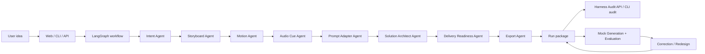

# Architecture Overview

ShotForge is an AI Video Creative Agent Harness POC. The video domain is the demonstration scenario; the reusable capability is the Agent Harness and delivery pattern around it.

## End-to-End Flow

## Core Runtime

| Capability | Implementation | Why It Matters |
|---|---|---|
| State Management | `ProjectState` | Single contract across agents, evaluation, readiness, exports, and audit |
| State Transition Audit | `StateTransitionRecord` | Before/after summaries, changed fields, and invariant checks per agent |
| Context Engineering | `ContextBuilder`, `ContextSource`, `ContextBuildPolicy` | Ranked, budgeted, redacted, digestable context per agent |
| Tool Orchestration | `SkillRegistry`, `ToolExecutionPolicy` | Tool authorization, call budgets, risk levels, status, latency, permission scope |
| Runtime Evidence | `AgentHarnessRuntime` | Context snapshots, MCP tools, sandbox policy, memory hits |
| Agent Contracts | `AgentSpec`, `AgentCatalog` | Agent roles, IO contracts, dependencies, skills, and extension points |
| Traceability | `TraceLog`, `VersionManager` | Run history, step timing, version snapshots |
| MCP Boundary | `LocalMCPAdapter` | Tool/resource discovery for knowledge, runs, packages, and harness audit |
| Sandbox Boundary | `LocalSandboxRunner`, `SandboxExecutionProfile` | Policy-gated execution with structured denial records |
| Memory | `LocalMemoryStore` | Namespaced, ranked, access-tracked JSONL memory with runtime run promotion |
| Knowledge Assets | `SolutionPlaybookStore`, JSON rubrics/rules | Reusable industry and quality patterns |
| Delivery Gates | `DeliveryReadinessReport` | Shows what is ready, mocked, and required before pilot |

## Public Interfaces

| Interface | Purpose |
|---|---|
| FastAPI Web Demo | Run the workflow and inspect results visually |
| `POST /api/runs` | Create design/evaluation/planning runs |
| `GET /api/runs/{run_id}/harness` | Inspect context, tools, policies, solution, and readiness |
| `GET /api/capabilities` | Inspect provider catalog, playbooks, exports, and infra capabilities |
| `shotforge design` | Generate a local run package |
| `shotforge audit` | Inspect an exported package from the terminal |

## Generated Deliverables

Each run can export:

- `package.json`
- `package.csv`
- `package.md`
- `manifest.json`
- `trace.json`
- `run_summary.md`
- `evaluation.csv` when evaluation runs

## How To Review The Project

1. Start with `README.md`.
2. Read this overview.
3. Run the Web Demo or `shotforge design`.
4. Open `manifest.json` and `run_summary.md`.
5. Call `/api/runs/{run_id}/harness` or run `shotforge audit`.
6. Review `docs/volcengine-jd-alignment.md` for role alignment.

## Production Boundary

The current project is intentionally local-first. It proves architecture and workflow shape without depending on paid video generation. Production hardening would add auth, tenant isolation, official MCP transport, stronger sandbox isolation, production storage, observability, and customer-specific knowledge overlays.
