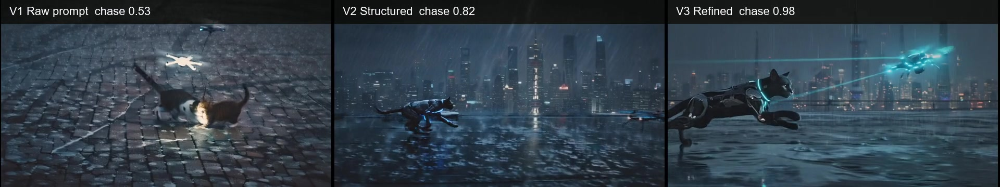

# Effect Demo

这个 demo 展示 ShotForge 的核心价值：同一个创意先直接生成，再结构化生成，最后根据视觉观察做一次迭代优化。

示例创意：

```text
一只赛博猫在雨夜上海屋顶追逐发光无人机。
```

## 看什么

| 版本 | 展示重点 |
| --- | --- |
| V1 | 原始提示词直接生成 |
| V2 | 结构化提示词提升主体、场景和动作表达 |
| V3 | 基于 V2 画面观察继续修正动作关系 |

本地实测示例中，“赛博猫追逐无人机”的动作关系从 `0.53 -> 0.82 -> 0.98`。总分也从 `0.836 -> 0.966 -> 0.989`，但 V3 更适合看目标项的定向修正，而不是只看已经接近饱和的总分。

[](../assets/effect-demo-v1-v2-v3-comparison.mp4)

## 示例配置

| 阶段 | 硬件 / 模型 |
| --- | --- |
| 硬件 | NVIDIA GeForce RTX 5090，32GB 显存 |
| LLM 规划 | Ollama `qwen3:30b` |
| 视频生成 | ComfyUI Wan2.2 I2V 14B FP8，1920x1088，5s，8fps |
| 视觉观察 | Ollama `qwen3-vl:30b`，抽帧 8 张 |

## 怎么跑

```powershell
shotforge effect-demo cyber_cat_rooftop --language zh --generator comfyui
```

运行后打开：

```text
/runs/<run_id>/effect-comparison?language=zh
```

## 发布建议

开源展示时建议只放：

- 一张 V1/V2/V3 对比截图，或一个压缩短视频
- 上面的运行命令
- 一个简短结果说明

模型权重、完整本地 run 目录、大体积视频和一次性 prompt 微调都不建议提交到仓库。demo 专用的展示策略只放在 `src/shotforge/workflows/effect_demo_workflow.py`，通用 workflow 保持干净。
